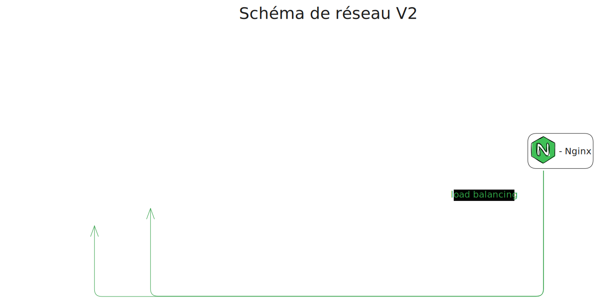
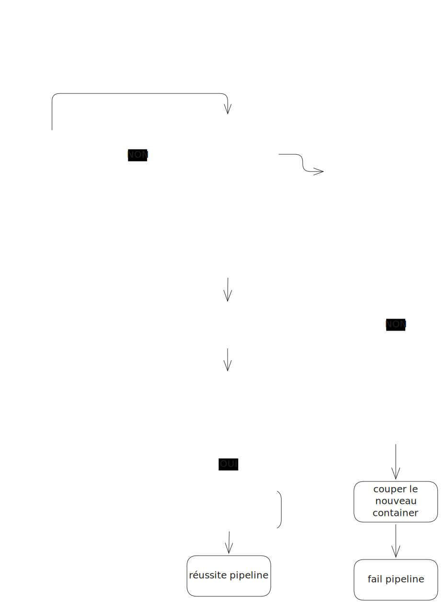
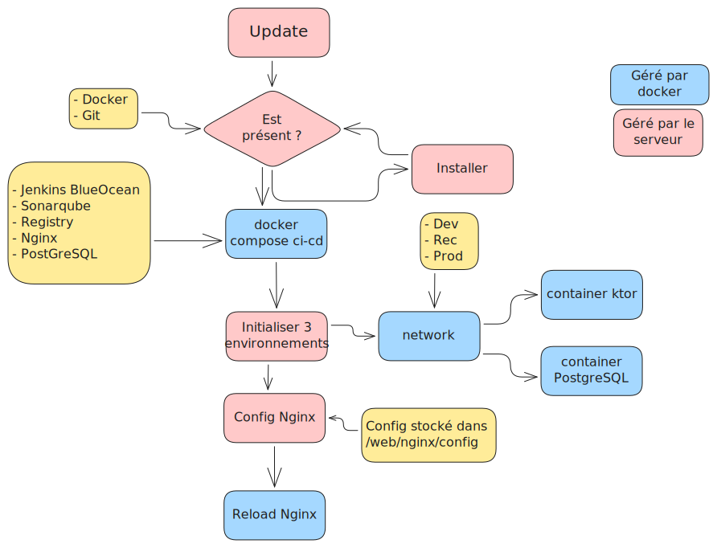

# Développement Opérationnel

Ce projet contient l'ensembles des README, Dockerfile, scripts liés au déploiement de l'application. Les outils sont déployés via l'outil de virtualisation **Docker**.

Une présentation Canva est disponible à ce [lien](https://www.canva.com/design/DAG0etyUpJE/eRwLGYtf6Q1lViWCVMNrQQ/edit?utm_content=DAG0etyUpJE&utm_campaign=designshare&utm_medium=link2&utm_source=sharebutton)

## Liens

- Jenkins : https://jenkins.noknok.dev
- SonarQube: https://sonarqube.noknok.dev
- Registry UI (si actif): http://194.164.77.125:5049/ _Pas de config Nginx pour le moment_

## Réseaux

Pour tous les tableaux la colonne `Port` indique le port sur le localhost de l'hôte

Réseau docker: ci-network

| Service     | Port  | Image                    |
| ----------- | ----- | ------------------------ |
| Blue Ocean  | 49000 | custom                   |
| Jenkins     | 2376  | jenkins/jenkins:2.516.3-jdk21              |
| SonarQube   | 9000  | sonarqube                |
| PostgreSQL  | 5432  | postgresql               |
| Registry    | 5050  | registry:2               |
| Registry UI | 5049  | joxit/docker-registry-ui |
Réseau: dev

| Service        | Port |
| -------------- | ---- |
| Ktor dev       | 5051 |
| Postgresql dev | 5433 |

Réseau: rec

| Service        | Port |
| -------------- | ---- |
| Ktor rec       | 5052 |
| Postgresql rec | 5434 |

Réseau: prod

| Service         | Port |
| --------------- | ---- |
| Ktor prod       | 5053 |
| Ktor prod 2     | 5054 |
| Postgresql prod | 5435 |

### Schéma du réseau

## Gestion du load balancing au déploiement

## Initialisation

Le script situé dans `scripts/init.sh` permet d'installer l'environnement CI/CD et les 3 environnements: dev, rec, prod

### Schéma d'initialisation

