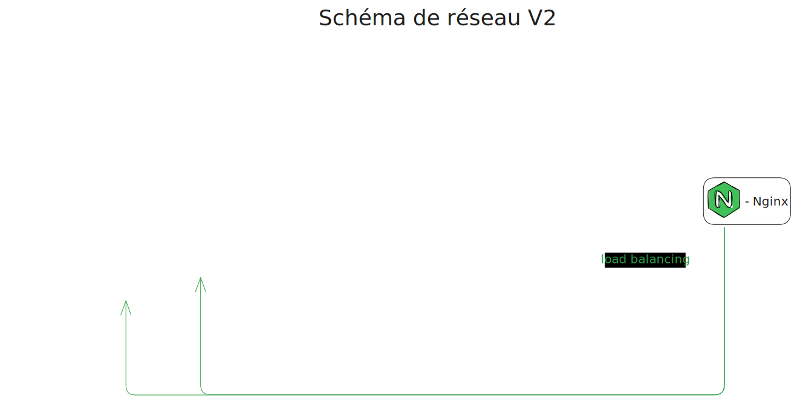

# Développement Opérationnel

Ce projet contient l'ensembles des README, Dockerfile, scripts liés aux déploiements d'application. Les outils sont déployés via l'outil de virtualisation **Docker**.

Une présentation Canva est disponible à ce [lien](https://www.canva.com/design/DAG0etyUpJE/eRwLGYtf6Q1lViWCVMNrQQ/edit?utm_content=DAG0etyUpJE&utm_campaign=designshare&utm_medium=link2&utm_source=sharebutton)

## Réseaux

Pour tous les tableaux la colonne `Port` indique le port sur le localhost de l'hôte

Réseau docker: ci-network

| Service                | Port | Image                                                 |
| ---------------------- | ---- | ----------------------------------------------------- |
| Blue Ocean             | /    | custom à partir de Jenkins LTS 21                     |
| Jenkins java runner    | /    | custom à partir de jenkinsinbound-agent:latest-jdk21  |
| Jenkins Android runner | /    | custom à partir de jenkins/inbound-agent:latest-jdk21 |
| SonarQube              | /    | sonarqube                                             |
| PostgreSQL             | 5432 | postgresql                                            |
| Registry               | 5050 | registry:2                                            |
| Registry UI            | /    | joxit/docker-registry-ui                              |

Réseau: monitoring

| Service       | Port | Image                           |
| ------------- | ---- | ------------------------------- |
| Grafana       | /    | grafana/grafana                 |
| Prometheus    | /    | prom/prometheus:latest          |
| Cadvisor      | /    | gcr.io/cadvisor/cadvisor:latest |
| node-exporter | /    | prom/node-exporter:v1.5.0       |

Serveur web:

| Service             | Port                                  |
| ------------------- | ------------------------------------- |
| Nginx               | 80 (réseau proxy)                     |
| Nginx Proxy Manager | 0.0.0.0:80 / 0.0.0.0:443 + réseau VPN |

### Schéma du réseau

## Initialisation

Le script situé dans `scripts/init.sh` permet d'installer l'environnement CI/CD et les 3 environnements: dev, rec, prod

# Ressources utilisés

## Développement des scripts Bash

- [W3School Bash](https://github.com/Joxit/docker-registry-ui)
- [Learn X in Y Minutes Bash fr](https://learnxinyminutes.com/fr/bash/)

## Utilisation de Docker

- [Doc Docker](https://docs.docker.com/): Gestion du daemon, container, image et commandes.

## Jenkins

- [Doc JenkinsFile](https://www.jenkins.io/doc/book/pipeline/jenkinsfile/)
- [Doc Pipeline Syntax](https://www.jenkins.io/doc/book/pipeline/syntax/)
- [Doc Jenkins](https://www.jenkins.io/doc/)
- [Doc Plugin Jenkins GitLab](https://plugins.jenkins.io/gitlab-plugin/)
- [Doc GitLab Intégration à Jenkins](https://docs.gitlab.com/integration/jenkins/)
- [Chaine Youtube CloudBeesTv](https://www.youtube.com/@CloudBeesTV): De nombreux tutoriels sur l'intégrations de plugins.

## Registry

- [Doc Registry](https://distribution.github.io/distribution/): Configuration et déploiement
- [Github Registry UI](https://github.com/Joxit/docker-registry-ui): Configuration de l'interface pour manager le registry

## Sonarqube

- [Doc Sonarqube](https://docs.sonarsource.com/sonarqube-community-build/server-installation)

## Portainer

- [Doc Portainer](https://docs.portainer.io/)

## Environnement de monitoring

- [Grafana](https://blog.stephane-robert.info/docs/observer/grafana/)
- [Prometheus](https://blog.stephane-robert.info/docs/observer/metriques/prometheus/#int%C3%A9gration-de-prometheus-avec-grafana)

0