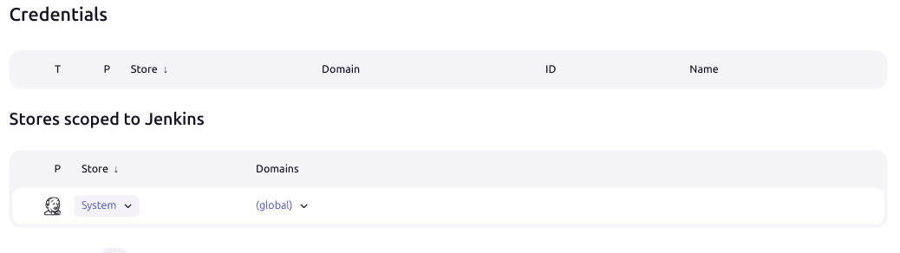

# Installation de Jenkins

Afin de lancer uniquement jenkins:

Positionnez vous dans le dossier `dev-ops/ci-cd/`

```
docker compose up -d  jenkins-blueocean
```

Pour lancer les deux runners:
```
docker compuse up -d jenkins-java-runner jenkins-android-runner
```

## Nginx et Jenkins
Suivre la configuration de la documentation de jenkins [lien](https://www.jenkins.io/doc/book/system-administration/reverse-proxy-configuration-with-jenkins/reverse-proxy-configuration-nginx/)

---

## Post Installation

Sur un navigateur web, tapez l'URL de la machine suivi de `:49000`.

### Trouver le mot de passe

Étant sur une installation Docker, tapez la commande suivante :

```bash
docker exec -it jenkins-blueocean bash
```

Puis :

```bash
cat /var/jenkins_home/secrets/initialAdminPassword
```

---

### Plugin

Sélection par défaut et le plugin **gitlab**.

---

# Configuration de Jenkins

## Déploiement avec GitLab

Nécessite :  
- Plugin GitLab

---

### 1. Configurer Git

Git est fourni dans le container.

Dans Jenkins :  
*Administrer Jenkins → Tools*  


---

### 2. Créer une paire de clé SSH

- Dans le container :

```bash
docker exec -it jenkins-blueocean bash
```

- Générer la clé  
  *Attention : Ne pas mettre de passphrase*

```bash
ssh-keygen -t ed25519 -C "jenkins@gitlab"
```

- Vérifier le host :

```bash
ssh -T git@gitlab.univ-nantes.fr
```

---

#### 3. Ajouter le credentials

Pour plus de détails : [doc](https://www.jenkins.io/doc/book/using/using-credentials/)

Dans Jenkins :  
*Administrer Jenkins → Credentials*

1. Cliquer sur **System**  
   
2. Sélectionner *Identifiants Globaux*
3. Bouton *+ Add Credentials*

- Type : SSH Username with private key
- Description : À votre guise
- Username : git
- Private key :  
  Copier-coller le contenu du fichier `/var/jenkins_home/.ssh/<clé_privé_généré>`

---

#### 4. Associer la clé à GitLab

Procédure standard d'ajout d'une clé publique à GitLab. Ceci permet au runner de cloner le repo.

---

#### 5. Configuration du projet Jenkins

Cliquer sur votre projet puis sur la roue crantée *Configuration*.

##### Triggers


##### Pipeline

Dans ce cas, deux choix s'offrent à vous :

1. **Pipeline Script dans Jenkins**  
   Votre script déclaratif est situé dans Jenkins et ne peut pas être mis à jour sans se connecter à ce dernier.

2. **Utilisation du gestionnaire de version**  
   Les **JenkinsFile** permettent d'indiquer la procédure de déploiement à Jenkins depuis votre projet. Le fichier est alors versionné et peut donc être plus rapidement soumis à des modifications.

---

## Intégration SonarQube
[Youtube](https://youtu.be/KsTMy0920go?si=SP-aJNGN_mX05OIq)

- Installer le plugin `SonarQube Scanner for Jenkins Version2.18`


# Ressources

- [Doc JenkinsFile](https://www.jenkins.io/doc/book/pipeline/jenkinsfile/)
- [Doc Pipeline Syntax](https://www.jenkins.io/doc/book/pipeline/syntax/)
- [Doc Jenkins](https://www.jenkins.io/doc/)
- [Doc Plugin GitLab](https://plugins.jenkins.io/gitlab-plugin/)
- [Doc GitLab Intégration à Jenkins](https://docs.gitlab.com/integration/jenkins/)