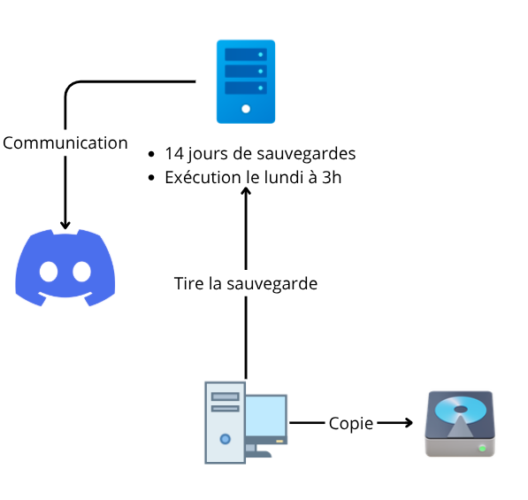

# Sauvegarde

La sauvegarde est géré côté par des tâches cron permettant de paramétrer l'exécution du script `server.sh`. Le script `client.sh` permet de récupérer cette sauvegarde en local


# Partie serveur 
script `server.sh`

## Configuration

1. Renommer le fichier `config.env-template` en `config.env`
2. Saisissez le contenu de vos variables d'environnements avec la liste des volumes à sauvegarder

## Exécution
```bash
bash server.sh
```
Ceci lance l'exécution du script, tous les volumes sont convertis en fichier `tar.gz`, un répertoire `/srv/docker-backups` est crée dans le répertoire `HOME` de l'utilisateur.

Le répertoire de l'archive est au format `Année-Mois-Jour`

### Rotation
À la fin de l’exécution du script, les répertoires existants sont triés, et tous ceux dont la date de modification est supérieure à 14 jours seront automatiquement supprimés.

## Cron

- Modifier les tâches cron
```bash
crontab -e
```
- Pour une exécution le **lundi** et le **jeudi** à 3h du matin
```bash
0 3 * * 1,4 bash /path/du/script/server.sh >> /path/des/logs/backup.log 2>&1
```

- Pour une exécution **hebdomadaire**, lundi à 3h du matin 
```bash
0 3 * * 1 bash /path/du/script/server.sh >> /path/des/logs/backup.log 2>&1
```

## Notification Discord 
A la fin de la sauvegarde, une notification de succès est envoyé avec l'url du webhook Discord.

# Partie client
script: `client.sh`

Configurer les variables du fichier `config.env`, ceci est un exemple de configuration 
```bash
SSH_SOURCE=ma-connection-ssh
SOURCE_PATH=/home/debian/srv/
DESTINATION_PATH=/home/debian/docker-backups
```
**Attention** : 
- Vérifiez le dossier de destination. S’il n’existe pas, il sera créé lors du premier lancement du script.  
- Si des fichiers ou dossiers y sont déjà présents, ils seront supprimés.  Il est donc recommandé d’utiliser un dossier dédié uniquement aux sauvegardes.

## Rsync
La synchronisation est effectué grâce à la commande `rsync`, elle doit être installé sur le **client** et le **serveur**

Pour installer rsync Debian / Ubuntu
```bash
sudo apt install rsync -y
```

### Options utilisés
- `-a`: archive -> préserve les permissions, dates
- `-v`: verbeux -> affichage de ce que fait la commande durant le processus
- `--deleted`: efface dans le répertoire destination les éléments qui ont disparu dans le répertoire source 


# Ressources
- [Rsync](https://doc.ubuntu-fr.org/rsync)