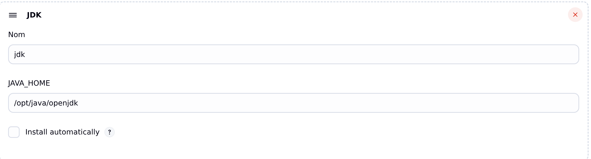
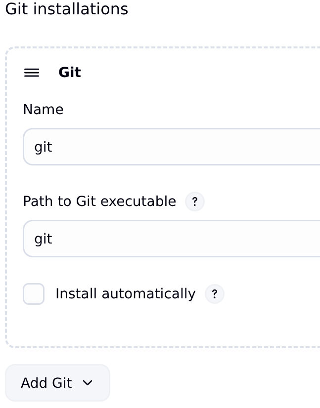
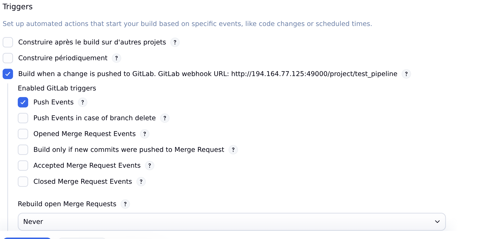

# Installation Jenkins Docker

Ce tutoriel est une installation **basique** de chez **basique** de Jenkins, je n'ai pas détaillé de notions de sécurité, utilisateurs, ni de multipipelines. De plus, ce guide peut contenir des **erreurs** car j'apprends également à me servir de l'outil.

---

## Création réseau Docker

```bash
docker network create jenkins
```

---

## Image Docker dind

Faire tourner des containers Docker dans un container Docker :

```bash
docker run \
  --name jenkins-docker \
  --rm \
  --detach \
  --privileged \
  --network jenkins \
  --network-alias docker \
  --env DOCKER_TLS_CERTDIR=/certs \
  --volume jenkins-docker-certs:/certs/client \
  --volume jenkins-data:/var/jenkins_home \
  --publish 2376:2376 \
  docker:dind \
  --storage-driver overlay2
```

---

## Créer l'image BlueOcean

**Dockerfile :**

```dockerfile
FROM jenkins/jenkins:2.516.3-jdk21
USER root
RUN apt-get update && apt-get install -y lsb-release ca-certificates curl && \
    install -m 0755 -d /etc/apt/keyrings && \
    curl -fsSL https://download.docker.com/linux/debian/gpg -o /etc/apt/keyrings/docker.asc && \
    chmod a+r /etc/apt/keyrings/docker.asc && \
    echo "deb [arch=$(dpkg --print-architecture) signed-by=/etc/apt/keyrings/docker.asc] \
    https://download.docker.com/linux/debian $(. /etc/os-release && echo \"$VERSION_CODENAME\") stable" \
    | tee /etc/apt/sources.list.d/docker.list > /dev/null && \
    apt-get update && apt-get install -y docker-ce-cli && \
    apt-get clean && rm -rf /var/lib/apt/lists/*
USER jenkins
RUN jenkins-plugin-cli --plugins "blueocean docker-workflow json-path-api"
```

---

### Build l'image

```bash
docker build -t myjenkins-blueocean:2.516.3-1 .
```

---

### Run l'image BlueOcean

Jenkins émettra sur le port 49000 du serveur :

```bash
docker run \
  --name jenkins-blueocean \
  --restart=on-failure \
  --detach \
  --network jenkins \
  --env DOCKER_HOST=tcp://docker:2376 \
  --env DOCKER_CERT_PATH=/certs/client \
  --env DOCKER_TLS_VERIFY=1 \
  --publish 49000:8080 \
  --volume jenkins-data:/var/jenkins_home \
  --volume jenkins-docker-certs:/certs/client:ro \
  myjenkins-blueocean:2.516.3-1
```

---

## UFW Config

### Autoriser Jenkins

La commande autorise la connexion TCP et UDP sur le port 49000 :

```bash
sudo ufw allow 49000
```

---

## Post Installation

Sur un navigateur web, tapez l'URL de la machine suivi de `:49000`.

### Trouver le mot de passe

Étant sur une installation Docker, tapez la commande suivante :

```bash
docker exec -it jenkins-blueocean bash
```

Puis :

```bash
cat /var/jenkins_home/secrets/initialAdminPassword
```

---

### Plugin

Sélection par défaut et le plugin **gitlab**.

---

# Configuration de Jenkins

## Déploiement avec GitLab

Nécessite :  
- Plugin GitLab

---

### 1. Configurer Java

Java est fourni dans le container Docker, il faut donc juste configurer la variable `JAVA_HOME`.

- Se connecter au container Docker :

```bash
docker exec -it jenkins-blueocean bash
```

- Afficher la variable :

```bash
echo $JAVA_HOME
```

Dans Jenkins :  
*Administrer Jenkins → Tools*  


---

### 2. Configurer Git

Git est fourni dans le container.

Dans Jenkins :  
*Administrer Jenkins → Tools*  


---

### 3. Créer une paire de clé SSH

- Dans le container :

```bash
docker exec -it jenkins-blueocean bash
```

- Générer la clé  
  *Attention : Ne pas mettre de passphrase*

```bash
ssh-keygen -t ed25519 -C "jenkins@gitlab"
```

- Vérifier le host :

```bash
ssh -T git@gitlab.univ-nantes.fr
```

---

#### 4. Ajouter le credentials

Pour plus de détails : [doc](https://www.jenkins.io/doc/book/using/using-credentials/)

Dans Jenkins :  
*Administrer Jenkins → Credentials*

1. Cliquer sur **System**  
   
2. Sélectionner *Identifiants Globaux*
3. Bouton *+ Add Credentials*

- Type : SSH Username with private key
- Description : À votre guise
- Username : git
- Private key :  
  Copier-coller le contenu du fichier `/var/jenkins_home/.ssh/<clé_privé_généré>`

---

#### 5. Associer la clé à GitLab

Procédure standard d'ajout d'une clé publique à GitLab. Ceci permet au runner de cloner le repo.

---

#### 6. Configuration du projet Jenkins

Cliquer sur votre projet puis sur la roue crantée *Configuration*.

##### Triggers



##### Pipeline

Dans ce cas, deux choix s'offrent à vous :

1. **Pipeline Script dans Jenkins**  
   Votre script déclaratif est situé dans Jenkins et ne peut pas être mis à jour sans se connecter à ce dernier.

2. **Utilisation du gestionnaire de version**  
   Les **JenkinsFile** permettent d'indiquer la procédure de déploiement à Jenkins depuis votre projet. Le fichier est alors versionné et peut donc être plus rapidement soumis à des modifications.

---

# Nginx et Jenkins
Suivre la configuration de la documentation de jenkins [lien](https://www.jenkins.io/doc/book/system-administration/reverse-proxy-configuration-with-jenkins/reverse-proxy-configuration-nginx/)

- Reconfigurer le pare-feu

```bash
sudo ufw deny 49000
```

- Down le container et le supprimer
```bash
docker container stop jenkins_blueocean
docker container remove jenkins_blueocean
```
- Relancer le container blue-ocean 

Modifier la partie publish afin de faire émettre le container uniquement sur le localhost
```
--publish 127.0.0.1:49000:8080
```


# Ressources

- [Doc JenkinsFile](https://www.jenkins.io/doc/book/pipeline/jenkinsfile/)
- [Doc Pipeline Syntax](https://www.jenkins.io/doc/book/pipeline/syntax/)
- [Doc Jenkins](https://www.jenkins.io/doc/)
- [Doc Plugin GitLab](https://plugins.jenkins.io/gitlab-plugin/)
- [Doc GitLab Intégration à Jenkins](https://docs.gitlab.com/integration/jenkins/)